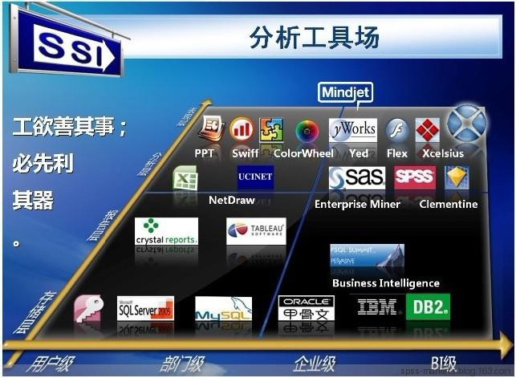
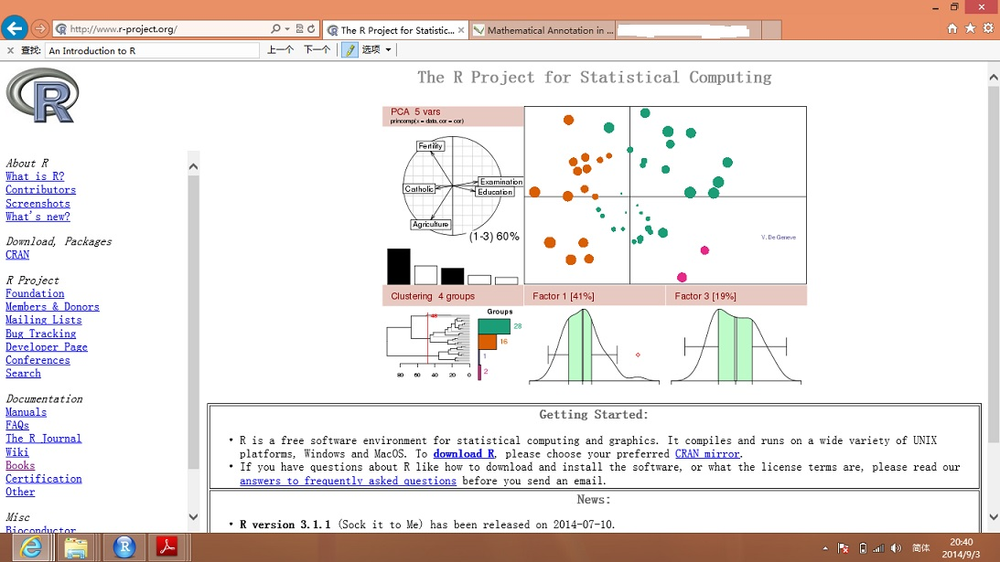
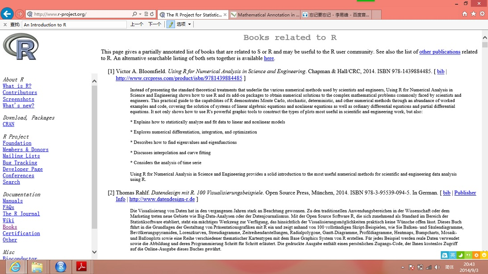
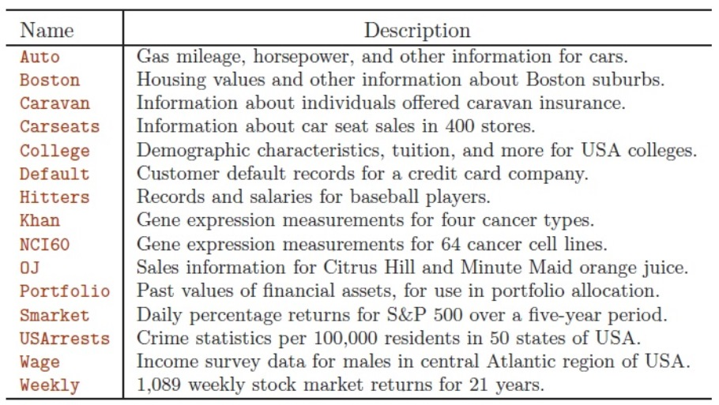

课程目标
========

  - 本课程旨在介绍经典统计方法思想并学习超出经典统计方法（比如线性回归）的相关研究内容。随着计算能力在近30多年的增强，高密度计算、回归技术或"统计学习"方法得到很大发展。特别是最近十几年，我们看到了大量统计学习方法数量的显著扩增。本课程的目标是提供对现代非线性方法，如广义可加模型、决策树、Bagging和Boosting算法以及支持向量机等应用性的理论概述，同时也详细的说明了经典线性方法，如Logistic回归、线性判别分析、K-均值聚类和最近邻法等更多的应用。   
       
  - 本课程还讨论了在市场营销，金融，医学以及其他重要领域下这些统计学习方法的应用。在课程结束的时候，你将对这些方法的工作原理有个基本的理解，并能够应用它们去分析真实背景下的数据。随着“大数据”问题的爆发，统计学习已经成为上面许多科学领域中的一个非常热门研究方向。拥有统计学习技术的人才正处在高需求的状况！   
       
  - 为此，本课程三分之一的时间将用于学生的上机操作实验课，这些实验课将确保每一个学生对统计学习方法的实用和理论方面都有一个充分的理解。


实例数据研究
============

 - 实例1. 预测股票市场的未来走势  


 - 实例2. 预测保险购买或欺诈行为  


 - 实例3. 营销对象分析及市场分析  


 - 实例4. 房地产估价因素分析  


 - 实例5. 垃圾邮件分类


 - 实例6. 前列腺癌患者的风险因素识别(微阵列样本分类)

课程资料
========

  - 统计或数据分析软件
  
  -    
 
  * 对于这样一门应用性课程，很显然选用一个好的统计软件和包是至关重要的。当然有很多软件和包可以实现本课程涉及的统计学习方法。但有些软件和包是商业软件且很昂贵。本课程选用R软件进行课程演示。主要是由于R软件有很多优势：  
  
  > R软件拥有一系列连贯且完整的数据分析方法，可以实现本课程涉及的所有统计学习方法甚至更多；
    
  > R软件更新统计技术很快，适合于科研人员使用；   
    
  > R软件很灵活，R语言和其它编程语言、数据库之间有很好的接口，且可以针对特定数据格式自己写函数及统计方法；
    
  > R软件具有丰富的网上资源，几乎所有的包是免费的，你可以从R官网http://www.r-project.org/上下载R软件及其相关的很多材料；
    
  > ......
    
  * 本课程将用到R软件包ISLR <http://cran.rproject.org/web/packages/ISLR/index.html> ，里面自含本课程的数据。
  
  * 还会用到R软件包DMwR <http://www.dcc.fc.up.pt/~ltorgo/DataMiningWithR/>，里面自含本课程的数据。
    
    
      
    

  * 初学者可以先看“An Introduction to R(Venables,Smith)，作为学习R的手册，电子版书籍可以从 <http://cran.r-project.org/doc/manuals/R-intro.pdf> 网站下载。
 
  - 课程教材   
    
  * 本课程教材主要参考 An Introduction to Statistical Learning with Applications in R (James, Witten, Hastie, and Tibshirani)和Data Mining with R Learning with Case Studies (Luis Torgo)。其电子教材可以从网站<http://wwwbcf.usc.edu/~gareth/ISL/index.html>下载，也可以从网站 <http://link.springer.com/book/10.1007/978-1-4614-7138-7/page/1> 和 <http://www.amazon.cn/An-Introduction-to-Statistical-Learning-With-Applications-in-R-James-Gareth/dp/1461471370/ref=sr_1_1?ie=UTF8&qid=1409586238&sr=8-1&keywords=an+introduction+to+statistical+learning+with+applications+in+r> 购买。
 
  - 课程评估   
    
  * 本课程评估主要以“作业”、“小测试”、“期中考试”、“项目研究”及“期终考试”来完成。各自所占成绩的比例如下：

```{r, echo=FALSE}
library(knitr)
tabeval <- matrix(c("作业(7~8次)", "小测试", "期中考试", "项目", "期终考试", "35%", "5%", "25%", "10%", "25%"), nrow=5, ncol=2)
dimnames(tabeval) <- list(c(), c("成绩评价项", "所占比例"))
kable(data.frame(tabeval), format = "markdown", align = "c")
```

课程大纲（初步）
===============

## 第1课 课程介绍

  - 现代数据挖掘及统计学习介绍
  
  - 不同统计学习方法的概述
  
  - 统计学习是什么？ 
  
     \ -- 推断与预测  
     
     \ -- 有监督与无监督学习问题  
     
     \ -- 回归与分类  
     
## 第2课 实验课1：R软件的介绍

  - 基本命令
  
  - 图形
  
  - 索引数据
  
  - 导入数据
  

## 第3课 评估统计学习方法的精确度

  - 不太灵活与更加灵活的方法
  
  - 训练与测试误差率
  
  - 最近邻算法
  
  - 贝叶斯分类器
  
  - 偏差与方差思想

## 第4课 线性回归(Linear Regression)

  - 线性回归模型
  
  - 用最小二乘法拟合模型
  
  - 检验统计显著性
  
  - 处理分类变量   
  
## 第5课 实验课2：线性回归模型构建   

  - 利用R函数*lm()*拟合线性回归模型

  - 利用R函数*predic()*建立预测
  
## 第6课 Logistic回归(Logistic Regression)

  - 利用Logistic函数进行分类
  
  - 估计回归系数
  
  - 估计类别概率
  
## 第7课 线性判别分析(Linear Discriminant Analysis (LDA))

 - 用于分类处理的贝叶斯定理
 
 - 估计贝叶斯分类器
 
 - 混淆矩阵
 
 - 二次判别分析
 
## 第8课 实验课3：Logistic回归模型和LDA构建

  - 利用R函数*glm()*拟合Logistic回归模型
  
  - 利用R函数*lda()*和*qda()*拟合LDA
  
## 第9课 重抽样方法(Resampling Methods)

  - 交叉验证(Cross Validation)
  
  - Bootstrap算法
  
## 第10课 实验课4：交叉验证和Bootstrap算法实现

  - 验证设置方法
  
  - LOOC 验证法
  
  - K-Fold 交叉验证法
  
## 第11课 变量选择(Variable Selection)

  - 最佳子集（最佳参数）回归(Best Subset Regression)
  
  - Leave Out抽样法
  
  - BIC和AIC评分法
  
  - 交叉验证法
  
  - 房地产数据实例
  
## 第12课 实验课5：K-最近邻法，最佳子集回归法

  - 利用R函数*knn()*实现最近邻法
  
  - 利用R函数*regsubsets()*实现最佳子集回归法
  
## 第13课 收缩与降维法(Shrinkage and Dimension Reduction Methods)

  - 岭回归(Ridge Regression)
  
  - LASSO收缩法
  
  - 房地产数据实例
  
  - 主成分回归(Principal Components Regression)
  
  - 偏最小二乘法(Partial Least Squares)
  
## 第14课 实验课6：收缩方法

  - 利用R函数*lm.ridge()*实现岭回归
  
  - 利用R函数*lars()*实现LASSO收缩法
  
  - 识别重要的影响变量
  
## 第15课 期中考试

## 第16课 涉及非线性的方法

  - 非线性回归(Non-Linear Regression)的介绍
  
  - 多项式回归(Polynomial Regression)
  
  - 样条曲线(Splines)
  
  - 股票S&P数据实例及模拟数据
  
## 第17课 广义可加模型(Generalized Additive Models)

  - 扩展线性回归并允许非线性关系
  
  - 扩展Logistc回归并允许非线性关系
  
  - 给定上周波动趋势对明天股票S&P价格的预测
  
## 第18课 实验课7：多项式回归，样条曲线和广义可加模型

  - 利用R函数*poly()*实现多项式回归
  
  - 利用R函数*smooth.spline()*拟合样条曲线
  
  - 利用R函数*gam()*产生广义可加模型
  
  - 股票S&P数据实例
  
## 第19课 树的方法

  - 决策树(Decision Trees)
  
  - 回归树与分类树(Regression vs. Classification Trees)
  
  - 修剪树(Pruning Trees)
  
## 第20课 Bagging和Boosting算法

  - 集成分类器：利用多分类改善预测精度
  
  - Bootstrap方法
  
  - 利用Bootstrap产生一个Bagged分类器
  
  - 另一类集成分类器
  
  - AdaBoost和其它Boosting算法
  
## 第21课 实验课8：树的方法

  - 利用R函数*tree()*生长回归与分类树
  
  - 利用R包*gbm*实现Boosting算法程序
  
## 第22课 支持向量机(Support Vector Machines (SVM))

  - 支持向量分类器
  
  - 计算用于分类的SVM
  
  - 基于罚项函数法(Penalization Method)的SVM
  
## 第23课 聚类方法

  - K-均值聚类法(K-means Clustering)
  
  - 分层聚类法(Hierarchical Clustering)
  
## 第24课 实验课10：SVM分类与聚类法实现

  - 利用R函数*svm()*产生SVM

  - 利用R函数*kmeans()*实现K-均值聚类
  
  - 利用R函数*hclust()*实现分层聚类
  
## 第25课 项目(Project)研究

## 第26课 项目1研究展示(Project Presentations)

## 第27课 项目2研究展示(Project Presentations)
